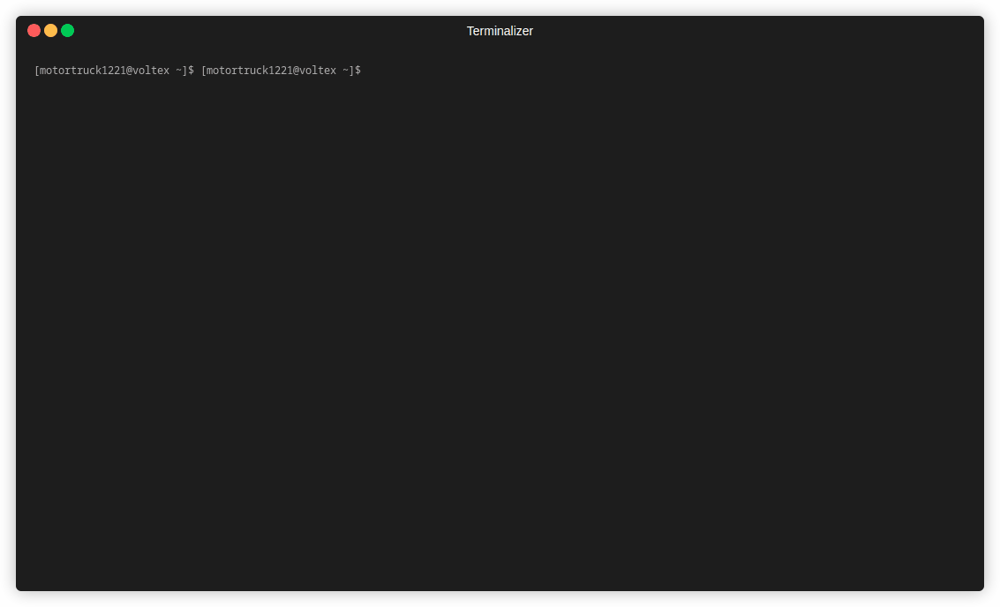

# Create Dreamland App (CDA)

Easily setup [dreamland.js](https://github.com/mercuryworkshop/dreamlandjs)

## Usage



### npx
```bash
npx create-dreamland-app@latest
```

### npm
```bash 
npm init dreamland-app
```

### yarn 
```bash 
yarn create dreamland-app 
```

### pnpm 
```bash 
pnpm create dreamland-app
```

### pnpm (dlx)
```bash
pnpm dlx create-dreamland-app@latest 
```
- Want to add a tool? Follow the guide here [./CONTRIBUTING.md](./CONTRIBUTING.md)
